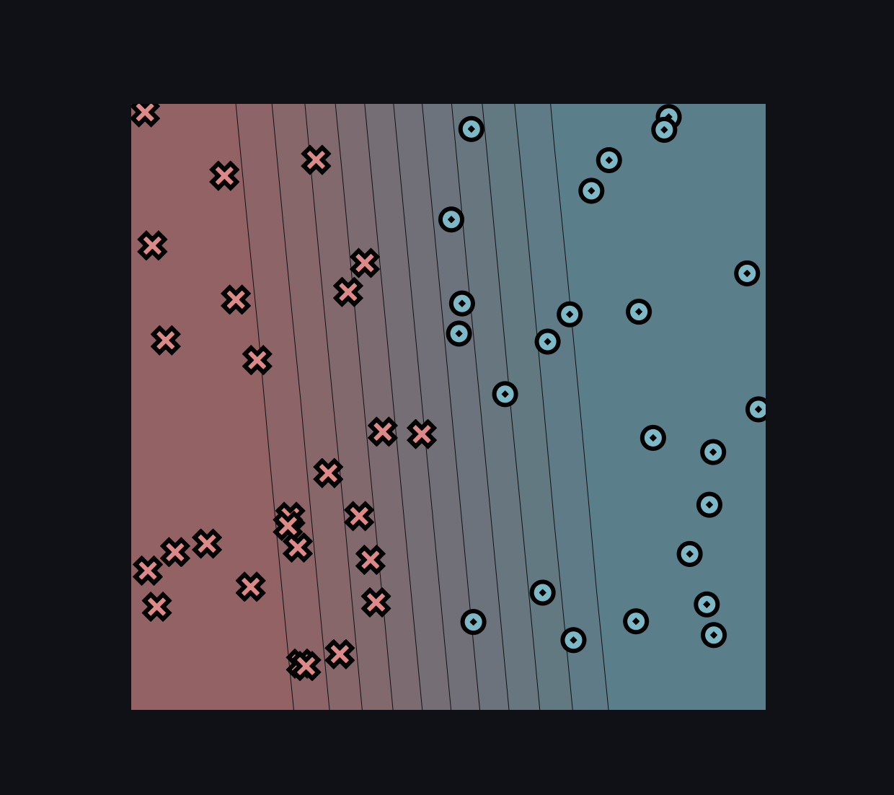
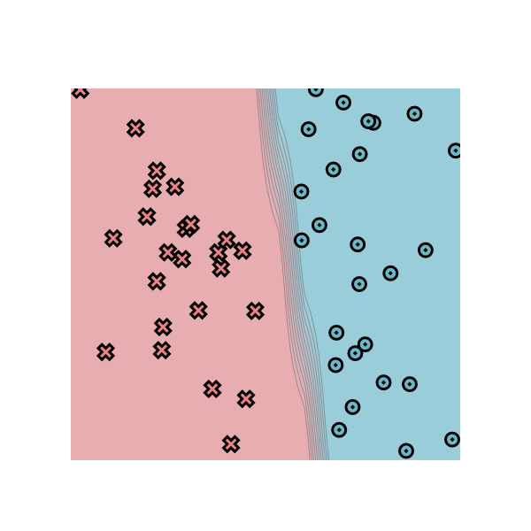
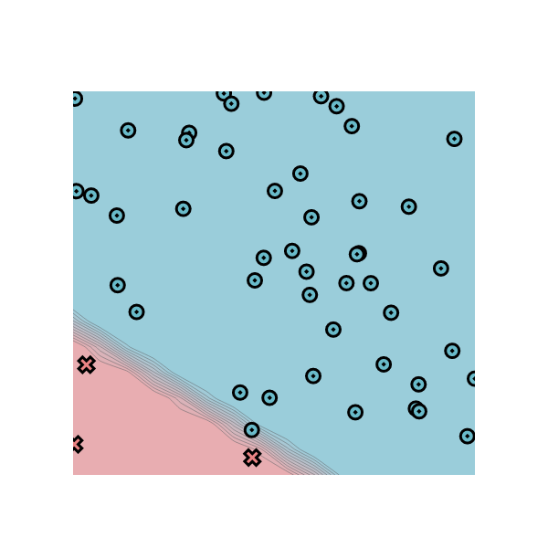
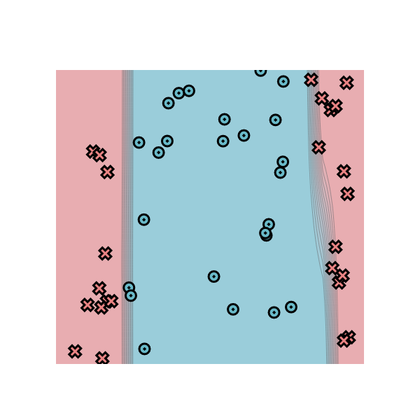
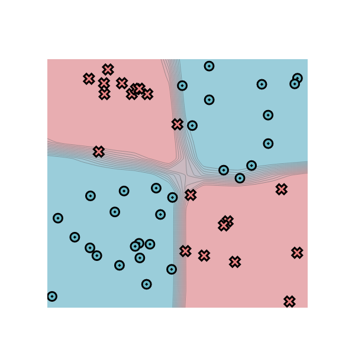

# minitorch
The full minitorch student suite. 


To access the autograder: 

* Module 0: https://classroom.github.com/a/qDYKZff9
* Module 1: https://classroom.github.com/a/6TiImUiy
* Module 2: https://classroom.github.com/a/0ZHJeTA0
* Module 3: https://classroom.github.com/a/U5CMJec1
* Module 4: https://classroom.github.com/a/04QA6HZK
* Quizzes: https://classroom.github.com/a/bGcGc12k

## Task 0.5



## Task 1.5

### Simple

Points: 50, hidden: 2, rate: 0.5, epochs: 500



```
Epoch  10  loss  33.69477611549826 correct 37
Epoch  20  loss  27.354090766340484 correct 45
Epoch  30  loss  23.836966028776885 correct 40
Epoch  40  loss  20.81160162491096 correct 40
Epoch  50  loss  10.395293339172051 correct 46
Epoch  60  loss  3.5533351860309823 correct 50
Epoch  70  loss  2.2339483862105745 correct 50
Epoch  80  loss  1.5821840597045171 correct 50
Epoch  90  loss  1.201989936651381 correct 50
Epoch  100  loss  0.9571393281940065 correct 50
Epoch  110  loss  0.7883298700438105 correct 50
Epoch  120  loss  0.6657774731846064 correct 50
Epoch  130  loss  0.5732601113787684 correct 50
Epoch  140  loss  0.5012701594318574 correct 50
Epoch  150  loss  0.4440317687171085 correct 50
Epoch  160  loss  0.3974057210441073 correct 50
Epoch  170  loss  0.3587827630360548 correct 50
Epoch  180  loss  0.3263317959858502 correct 50
Epoch  190  loss  0.29873210810708734 correct 50
Epoch  200  loss  0.2750086140188019 correct 50
Epoch  210  loss  0.2544267414689827 correct 50
Epoch  220  loss  0.23642327896779827 correct 50
Epoch  230  loss  0.2205596513298012 correct 50
Epoch  240  loss  0.20648960175727676 correct 50
Epoch  250  loss  0.193936371038556 correct 50
Epoch  260  loss  0.1826762829900424 correct 50
Epoch  270  loss  0.17252674077046176 correct 50
Epoch  280  loss  0.16333731669970128 correct 50
Epoch  290  loss  0.15498304810929753 correct 50
Epoch  300  loss  0.1473593303399838 correct 50
Epoch  310  loss  0.14037798214074615 correct 50
Epoch  320  loss  0.13396418264436583 correct 50
Epoch  330  loss  0.12805406387336166 correct 50
Epoch  340  loss  0.12259280161428093 correct 50
Epoch  350  loss  0.1175330889703198 correct 50
Epoch  360  loss  0.11283390649009749 correct 50
Epoch  370  loss  0.10845952413313789 correct 50
Epoch  380  loss  0.10437868592948064 correct 50
Epoch  390  loss  0.10056393969669634 correct 50
Epoch  400  loss  0.09699108274827685 correct 50
Epoch  410  loss  0.09363870097003907 correct 50
Epoch  420  loss  0.09048778352567742 correct 50
Epoch  430  loss  0.08752139918572499 correct 50
Epoch  440  loss  0.08472442314900158 correct 50
Epoch  450  loss  0.08208469313356909 correct 50
Epoch  460  loss  0.07959297386708285 correct 50
Epoch  470  loss  0.07723324958817726 correct 50
Epoch  480  loss  0.07499568635512828 correct 50
Epoch  490  loss  0.072871407884905 correct 50
Epoch  500  loss  0.070852359557429 correct 50
```

### Diag

Points: 50, hidden: 4, rate: 0.5, epochs: 500



```
Epoch  10  loss  9.240979932882313 correct 47
Epoch  20  loss  8.123545341382503 correct 47
Epoch  30  loss  7.203308688643567 correct 47
Epoch  40  loss  6.355253209984459 correct 47
Epoch  50  loss  5.74913542180636 correct 47
Epoch  60  loss  5.219237900918899 correct 47
Epoch  70  loss  4.758431302237008 correct 47
Epoch  80  loss  4.379346046517438 correct 47
Epoch  90  loss  4.052113550306482 correct 47
Epoch  100  loss  3.788837879479786 correct 47
Epoch  110  loss  3.521550444744429 correct 47
Epoch  120  loss  3.303532528655949 correct 47
Epoch  130  loss  3.059557743180504 correct 49
Epoch  140  loss  2.871534919126323 correct 49
Epoch  150  loss  2.7029645607126915 correct 49
Epoch  160  loss  2.5529530900742343 correct 49
Epoch  170  loss  2.4616062032559407 correct 49
Epoch  180  loss  2.3361561686646937 correct 49
Epoch  190  loss  2.2216104561448757 correct 49
Epoch  200  loss  2.1162063828944926 correct 49
Epoch  210  loss  2.0193382021730466 correct 49
Epoch  220  loss  1.9264394400685778 correct 50
Epoch  230  loss  1.795443607748274 correct 50
Epoch  240  loss  1.7214554950115275 correct 50
Epoch  250  loss  1.6536426840532465 correct 50
Epoch  260  loss  1.6308777937307775 correct 50
Epoch  270  loss  1.5379187125404985 correct 50
Epoch  280  loss  1.474194292110199 correct 50
Epoch  290  loss  1.4556889372534185 correct 50
Epoch  300  loss  1.387069482367605 correct 50
Epoch  310  loss  1.3352826303160328 correct 50
Epoch  320  loss  1.2828708924622103 correct 50
Epoch  330  loss  1.2545933545728256 correct 50
Epoch  340  loss  1.203827027303915 correct 50
Epoch  350  loss  1.1703723359849216 correct 50
Epoch  360  loss  1.1338617678625127 correct 50
Epoch  370  loss  1.1024537138744774 correct 50
Epoch  380  loss  1.0700163598591608 correct 50
Epoch  390  loss  1.042432024564879 correct 50
Epoch  400  loss  1.013273853680387 correct 50
Epoch  410  loss  0.9879695167040221 correct 50
Epoch  420  loss  0.9611715001065122 correct 50
Epoch  430  loss  0.9377799561957441 correct 50
Epoch  440  loss  0.9134110801129913 correct 50
Epoch  450  loss  0.8922912923361852 correct 50
Epoch  460  loss  0.8701257109520437 correct 50
Epoch  470  loss  0.8852262067933917 correct 50
Epoch  480  loss  0.8304138377485184 correct 50
Epoch  490  loss  0.811079110776826 correct 50
Epoch  500  loss  0.8147220379212909 correct 50
```

### Split

Points: 50, hidden: 10, rate: 0.5, epochs: 1000



```
Epoch  10  loss  33.7811291078602 correct 33
Epoch  20  loss  31.939601974819784 correct 39
Epoch  30  loss  29.754871891130037 correct 40
Epoch  40  loss  27.159832122367547 correct 42
Epoch  50  loss  24.445815765313533 correct 38
Epoch  60  loss  25.20136821200363 correct 38
Epoch  70  loss  23.77252869930141 correct 39
Epoch  80  loss  26.63542449207372 correct 32
Epoch  90  loss  24.0452360817708 correct 34
Epoch  100  loss  22.268055834148313 correct 37
Epoch  110  loss  22.44226770201173 correct 36
Epoch  120  loss  20.382466185903176 correct 39
Epoch  130  loss  21.633421397671423 correct 36
Epoch  140  loss  17.150001785681727 correct 43
Epoch  150  loss  19.657664379287958 correct 38
Epoch  160  loss  12.464006318313627 correct 46
Epoch  170  loss  26.281941619737967 correct 33
Epoch  180  loss  6.707944186578031 correct 50
Epoch  190  loss  4.415924642506338 correct 50
Epoch  200  loss  3.426580737224435 correct 50
Epoch  210  loss  2.771045526144806 correct 50
Epoch  220  loss  2.3055675318190123 correct 50
Epoch  230  loss  1.961164580029918 correct 50
Epoch  240  loss  1.6963634034777593 correct 50
Epoch  250  loss  1.4878192286684853 correct 50
Epoch  260  loss  1.319634159785014 correct 50
Epoch  270  loss  1.181608899890751 correct 50
Epoch  280  loss  1.0671502611235943 correct 50
Epoch  290  loss  0.9706627886085212 correct 50
Epoch  300  loss  0.888296122270906 correct 50
Epoch  310  loss  0.8169076459878318 correct 50
Epoch  320  loss  0.7549452268377888 correct 50
Epoch  330  loss  0.7008180906387983 correct 50
Epoch  340  loss  0.653132901625926 correct 50
Epoch  350  loss  0.6109549516041415 correct 50
Epoch  360  loss  0.5734724098023218 correct 50
Epoch  370  loss  0.5398053253093633 correct 50
Epoch  380  loss  0.5095995651871958 correct 50
Epoch  390  loss  0.48204562906603493 correct 50
Epoch  400  loss  0.4570089471631249 correct 50
Epoch  410  loss  0.4340997284084353 correct 50
Epoch  420  loss  0.41322238351515994 correct 50
Epoch  430  loss  0.3939692374089896 correct 50
Epoch  440  loss  0.3762343192184809 correct 50
Epoch  450  loss  0.3599064669247626 correct 50
Epoch  460  loss  0.34481482819796133 correct 50
Epoch  470  loss  0.3308351176795467 correct 50
Epoch  480  loss  0.3177714652630094 correct 50
Epoch  490  loss  0.3055937880171165 correct 50
Epoch  500  loss  0.2942296283056224 correct 50
Epoch  510  loss  0.2836142102040881 correct 50
Epoch  520  loss  0.2736976230228517 correct 50
Epoch  530  loss  0.2643168017713113 correct 50
Epoch  540  loss  0.25550475671404566 correct 50
Epoch  550  loss  0.2472030472141837 correct 50
Epoch  560  loss  0.239366453669134 correct 50
Epoch  570  loss  0.23195888955143346 correct 50
Epoch  580  loss  0.22500032849041238 correct 50
Epoch  590  loss  0.21834920396269447 correct 50
Epoch  600  loss  0.21204468853970615 correct 50
Epoch  610  loss  0.20605657057298518 correct 50
Epoch  620  loss  0.20036257475398442 correct 50
Epoch  630  loss  0.19494204108618773 correct 50
Epoch  640  loss  0.18977686030358648 correct 50
Epoch  650  loss  0.18485037847886243 correct 50
Epoch  660  loss  0.18017194068472003 correct 50
Epoch  670  loss  0.17568861478379444 correct 50
Epoch  680  loss  0.1713864377995894 correct 50
Epoch  690  loss  0.16727098087702202 correct 50
Epoch  700  loss  0.16332879623548993 correct 50
Epoch  710  loss  0.15954903950951368 correct 50
Epoch  720  loss  0.15592312279519369 correct 50
Epoch  730  loss  0.1524416888954591 correct 50
Epoch  740  loss  0.14909645583473752 correct 50
Epoch  750  loss  0.14588032619114602 correct 50
Epoch  760  loss  0.14279636265212903 correct 50
Epoch  770  loss  0.13983261762812038 correct 50
Epoch  780  loss  0.13696243740689687 correct 50
Epoch  790  loss  0.1341945464147895 correct 50
Epoch  800  loss  0.13152668256118388 correct 50
Epoch  810  loss  0.12895232376796895 correct 50
Epoch  820  loss  0.12646691840270174 correct 50
Epoch  830  loss  0.12406578697370897 correct 50
Epoch  840  loss  0.12174528993503878 correct 50
Epoch  850  loss  0.11950184474983135 correct 50
Epoch  860  loss  0.1173325685943274 correct 50
Epoch  870  loss  0.11523308733372119 correct 50
Epoch  880  loss  0.11320284395770301 correct 50
Epoch  890  loss  0.111246053667245 correct 50
Epoch  900  loss  0.1093386817536106 correct 50
Epoch  910  loss  0.10748619571349298 correct 50
Epoch  920  loss  0.10569005977768804 correct 50
Epoch  930  loss  0.10394730669816066 correct 50
Epoch  940  loss  0.10225537817293438 correct 50
Epoch  950  loss  0.10061231598211488 correct 50
Epoch  960  loss  0.09901619294201439 correct 50
Epoch  970  loss  0.09746490724175166 correct 50
Epoch  980  loss  0.0959567584854672 correct 50
Epoch  990  loss  0.09449011133761585 correct 50
Epoch  1000  loss  0.09306332610370717 correct 50
```

### Xor

Points: 50, hidden: 10, rate: 0.5, epochs: 500



```
Epoch  10  loss  32.164241226525974 correct 32
Epoch  20  loss  31.384712834062743 correct 30
Epoch  30  loss  29.121887957068942 correct 35
Epoch  40  loss  26.716084344690408 correct 36
Epoch  50  loss  24.034500319969883 correct 39
Epoch  60  loss  21.705396723238422 correct 39
Epoch  70  loss  19.06865403849203 correct 40
Epoch  80  loss  14.829774752049412 correct 44
Epoch  90  loss  12.677246050923843 correct 44
Epoch  100  loss  11.4141149142467 correct 46
Epoch  110  loss  9.98940024624883 correct 46
Epoch  120  loss  9.273103778692356 correct 47
Epoch  130  loss  9.200075236690939 correct 46
Epoch  140  loss  8.271523074717074 correct 46
Epoch  150  loss  8.145097573755072 correct 46
Epoch  160  loss  8.145379830766284 correct 47
Epoch  170  loss  7.209093032126205 correct 48
Epoch  180  loss  9.245436105025046 correct 46
Epoch  190  loss  7.387953238340742 correct 46
Epoch  200  loss  6.729786507551838 correct 46
Epoch  210  loss  6.153320655335928 correct 48
Epoch  220  loss  5.900012054939524 correct 48
Epoch  230  loss  5.71000755738743 correct 48
Epoch  240  loss  5.582648285579324 correct 48
Epoch  250  loss  5.433600470313037 correct 48
Epoch  260  loss  5.191958344399842 correct 48
Epoch  270  loss  8.616247215731985 correct 46
Epoch  280  loss  6.257083063161044 correct 47
Epoch  290  loss  5.955290686139803 correct 47
Epoch  300  loss  5.412195993834916 correct 47
Epoch  310  loss  4.829145378230068 correct 47
Epoch  320  loss  4.514850174828044 correct 47
Epoch  330  loss  5.362370079540392 correct 47
Epoch  340  loss  5.437332687563413 correct 47
Epoch  350  loss  3.440874926819094 correct 50
Epoch  360  loss  3.14831924712219 correct 50
Epoch  370  loss  8.6307819241856 correct 46
Epoch  380  loss  6.589274246574279 correct 46
Epoch  390  loss  4.92604938113465 correct 48
Epoch  400  loss  5.455806963049915 correct 48
Epoch  410  loss  3.3663860188007044 correct 49
Epoch  420  loss  7.187629873329428 correct 46
Epoch  430  loss  4.273092601766106 correct 47
Epoch  440  loss  3.0944114810227257 correct 50
Epoch  450  loss  3.7882776341866577 correct 48
Epoch  460  loss  3.2071821592370586 correct 49
Epoch  470  loss  3.670905710674126 correct 48
Epoch  480  loss  4.504608757377443 correct 47
Epoch  490  loss  3.1127525059986074 correct 50
Epoch  500  loss  2.861591534185577 correct 50
```
